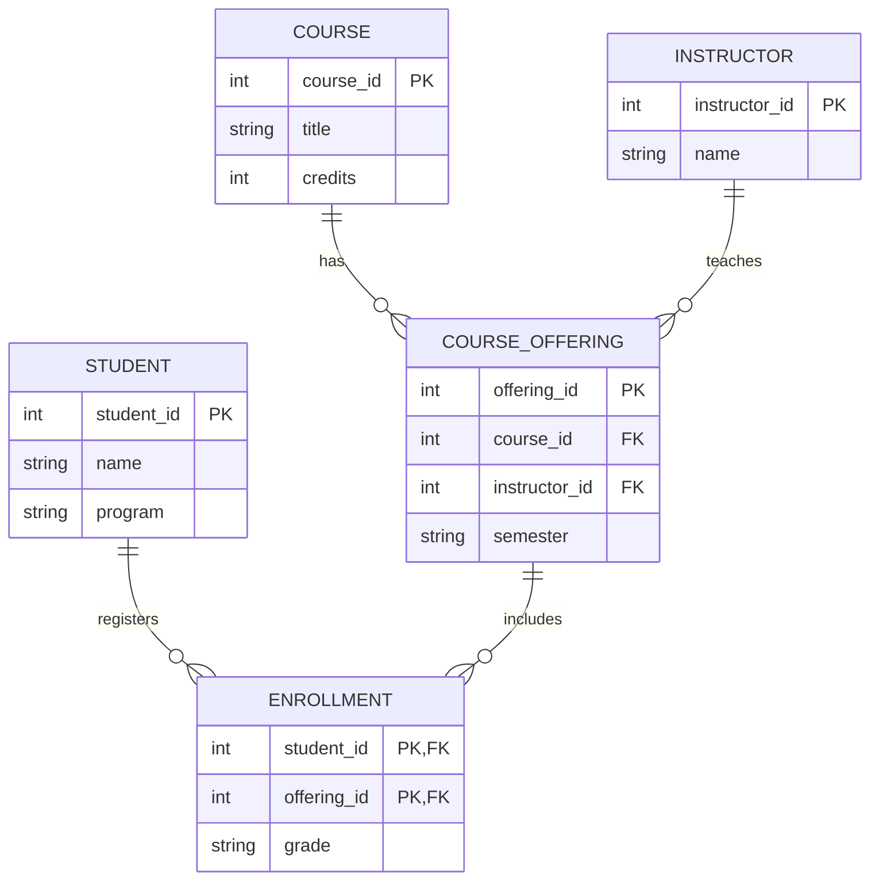
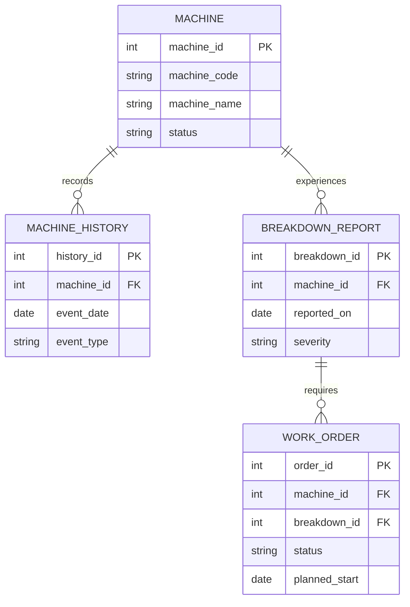

# ER sketches

## Sketch 1: University registration

```mermaid
erDiagram
    STUDENT ||--o{ ENROLLMENT : registers
    COURSE ||--o{ COURSE_OFFERING : has
    INSTRUCTOR ||--o{ COURSE_OFFERING : teaches
    COURSE_OFFERING ||--o{ ENROLLMENT : includes

    STUDENT {
        int student_id PK
        string name
        string program
    }
    ENROLLMENT {
        int student_id PK, FK
        int offering_id PK, FK
        string grade
    }
    COURSE {
        int course_id PK
        string title
        int credits
    }
    COURSE_OFFERING {
        int offering_id PK
        int course_id FK
        int instructor_id FK
        string semester
    }
    INSTRUCTOR {
        int instructor_id PK
        string name
    }
```

## Sketch 2: Machine maintenance

```mermaid
erDiagram
    MACHINE ||--o{ MACHINE_HISTORY : records
    MACHINE ||--o{ BREAKDOWN_REPORT : experiences
    BREAKDOWN_REPORT ||--o{ WORK_ORDER : requires

    MACHINE {
        int machine_id PK
        string machine_code
        string machine_name
        string status
    }
    MACHINE_HISTORY {
        int history_id PK
        int machine_id FK
        date event_date
        string event_type
    }
    BREAKDOWN_REPORT {
        int breakdown_id PK
        int machine_id FK
        date reported_on
        string severity
    }
    WORK_ORDER {
        int order_id PK
        int machine_id FK
        int breakdown_id FK
        string status
        date planned_start
    }
```
